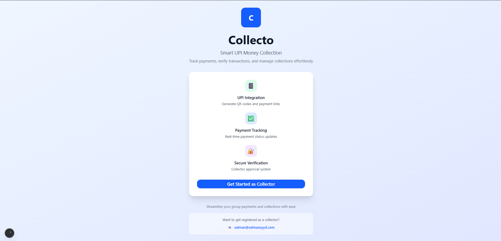
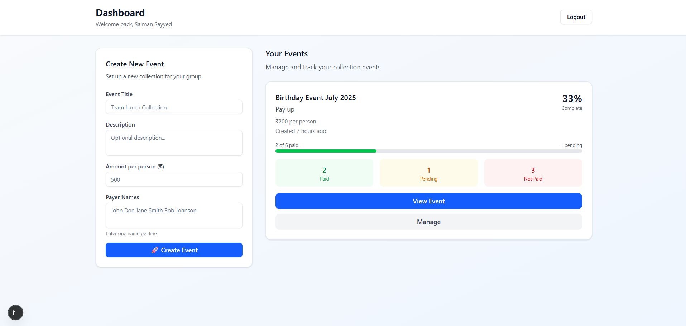
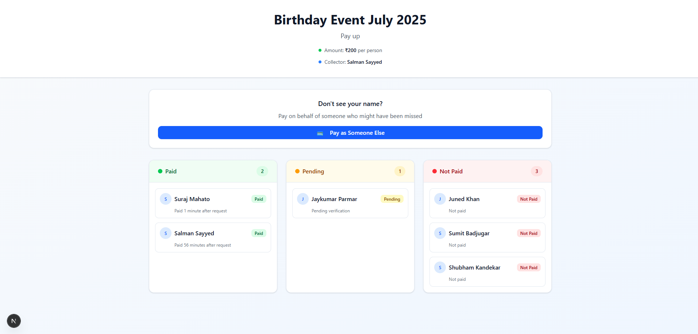

# Collecto 💳

**Smart UPI Money Collection & Payment Tracking System**

A modern web application that simplifies group payment collection and provides real-time payment status tracking with UPI integration.

---

## 🎯 The Problem I Solved

As someone who frequently organizes group events, I faced a recurring challenge: **tracking who has paid and who hasn't** when collecting money from multiple people. Traditional methods like maintaining spreadsheets or asking everyone individually were time-consuming and error-prone.

The main pain points I identified were:
- **No visibility** into payment status across the group
- **Manual tracking** leading to confusion and missed payments  
- **Lack of verification system** for claimed payments
- **Poor user experience** for both collectors and payers
- **No centralized platform** to manage multiple collection events

## 💡 My Solution

I built **Collecto** - a comprehensive payment collection platform that addresses these challenges through:

### 🔐 **Secure Collector Authentication**
- JWT-based authentication system
- Protected collector dashboards
- Session management with secure cookies

### 📊 **Real-time Payment Tracking**
- **Three-state system**: Not Paid → Pending Verification → Paid
- Visual progress indicators and completion percentages
- Time-based analytics showing payment patterns

### 🎨 **Modern, Responsive UI**
- Mobile-first design supporting screens as small as 280px
- Gradient backgrounds and card-based layouts
- Smooth animations and micro-interactions
- Consistent design system across all components

### 💳 **UPI Integration**
- Dynamic QR code generation for each payment
- Deep-link support for all major UPI apps
- Optimized for GPay, PhonePe, Paytm, and others
- Custom transaction notes for better tracking

### ✅ **Smart Verification System**
- Two-step verification process (claim → approve)
- Collector dashboard for payment management
- Bulk verification capabilities
- Fraud prevention through manual approval

## 🛠️ Technical Architecture

### **Frontend**
- **Next.js 14** with App Router for modern React development
- **TypeScript** for type safety and better developer experience
- **Tailwind CSS** for responsive, utility-first styling
- **Shadcn/ui** components for consistent UI elements

### **Backend**
- **Next.js API Routes** for serverless backend functionality
- **MongoDB** with Mongoose for data persistence
- **JWT Authentication** for secure session management
- **bcryptjs** for password hashing

### **Key Features**
- **Server-side rendering** for better SEO and performance
- **Mobile-responsive design** with custom breakpoints
- **Real-time updates** through page refreshes
- **Error handling** with custom 404 and error pages

## 🚀 Features

### For Collectors
- **Dashboard Overview**: See all collection events with completion stats
- **Event Creation**: Set up new collections with payer lists
- **Payment Verification**: Approve or reject payment claims
- **Progress Tracking**: Visual indicators of collection status
- **Mobile Management**: Full functionality on mobile devices

### For Payers
- **Payment Options**: QR code scanning or UPI deep-links
- **Status Visibility**: See your payment status in real-time
- **Pay-as-Someone**: Help others who might have been missed
- **Mobile Optimized**: Seamless experience on all devices

### Technical Highlights
- **Type-safe Development**: Full TypeScript implementation
- **Responsive Design**: Works on screens from 280px to desktop
- **Modern UI/UX**: Gradient backgrounds, smooth animations
- **Security First**: Protected routes and secure authentication
- **Performance Optimized**: Server-side rendering and efficient queries

## 📱 Screenshots

### Homepage

Clean, modern landing page with feature highlights and contact information.

### Collector Dashboard  

Comprehensive overview of all collection events with real-time statistics.

### Payment Tracking

Visual representation of payment status with three distinct categories.

### Mobile Experience
Fully responsive design that works seamlessly on all device sizes.

## 🔧 Installation & Setup

```bash
# Clone the repository
git clone https://github.com/yourusername/collecto.git
cd collecto

# Install dependencies
npm install

# Set up environment variables
cp .env.example .env.local
# Add your MongoDB connection string and JWT secret

# Run the development server
npm run dev
```

### Environment Variables
```env
MONGODB_URI=your_mongodb_connection_string
JWT_SECRET=your_jwt_secret_key
```

### Database Setup
```bash
# Run the collector setup script
node scripts/setup-collector.js
```

## 🎨 Design Philosophy

I focused on creating a **user-centric design** that prioritizes:

- **Clarity**: Clear visual hierarchy and intuitive navigation
- **Accessibility**: Proper contrast ratios and touch-friendly interfaces  
- **Responsiveness**: Seamless experience across all device sizes
- **Performance**: Fast loading times and smooth interactions
- **Consistency**: Unified design language throughout the application

## 🔮 Future Enhancements

While the current version solves the core problem effectively, I have plans for:

- **Automated Notifications**: SMS/Email alerts for payment reminders
- **Analytics Dashboard**: Detailed insights into payment patterns
- **Multi-currency Support**: Support for different currencies
- **Bulk Operations**: Mass import/export of payer lists
- **Integration APIs**: Connect with popular event management tools

## 🤝 Contributing

I welcome contributions to make Collecto even better! Whether it's:
- Bug fixes and improvements
- New feature suggestions  
- UI/UX enhancements
- Documentation updates

Feel free to open issues or submit pull requests.

## 📞 Contact

**Salman Sayyed**  
📧 [salman@salmansyyd.com](mailto:salman@salmansyyd.com)

For collector registration or support, please reach out via email.

---

## 🙏 Acknowledgments

This project was built to solve a real-world problem I encountered frequently. The goal was to create something that would genuinely help people manage group payments more efficiently while providing a delightful user experience.

The modern web stack (Next.js, TypeScript, Tailwind) enabled rapid development while maintaining code quality and performance. The responsive design ensures that users can manage their collections from anywhere, on any device.

---

**Built with ❤️ to simplify group payment collection**